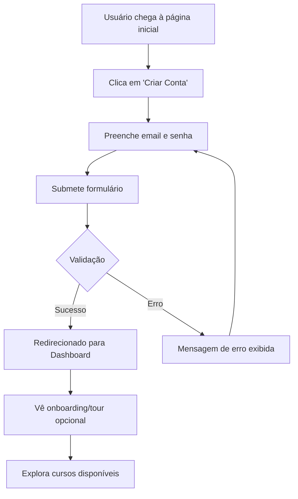
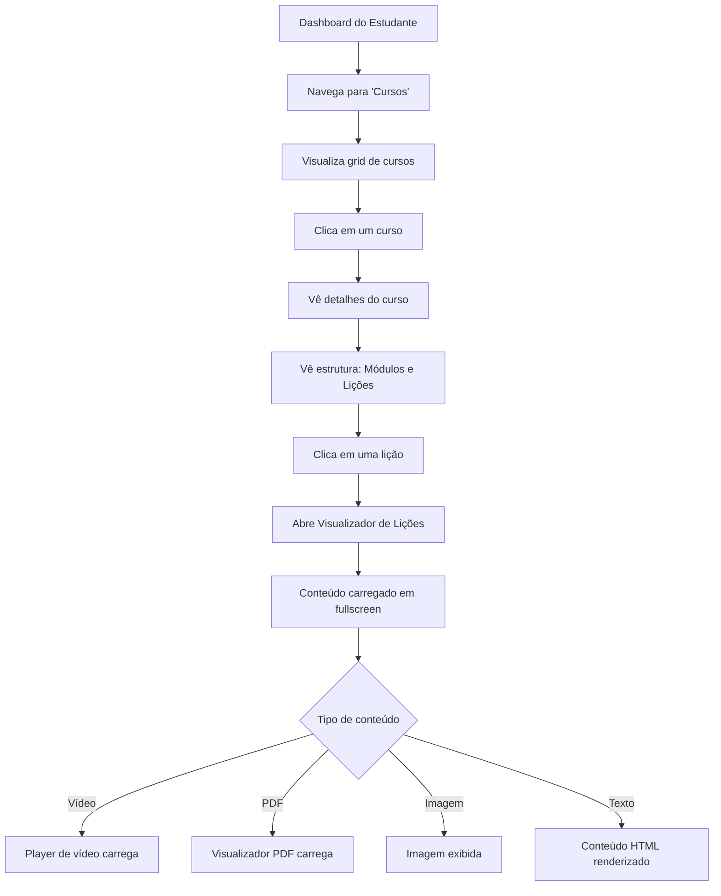
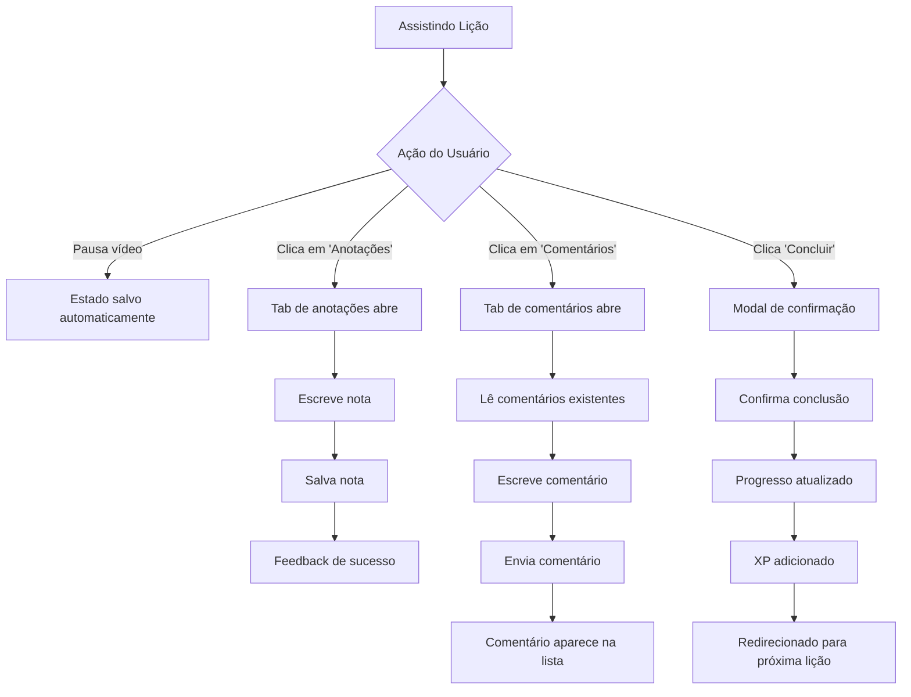
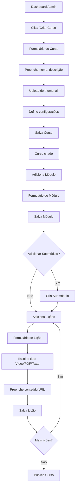

# 3. Prototipação e Design de Interação (IxD)

## Wireframes e Fluxos de Interação

### Arquitetura de Informação

```
Sistema de Gestão de Cursos
│
├── Área do Estudante
│   ├── Dashboard
│   │   ├── Meus Cursos
│   │   ├── Progresso Geral
│   │   └── Atividades Recentes
│   │
│   ├── Cursos
│   │   ├── Listagem de Cursos
│   │   └── Detalhes do Curso
│   │       ├── Informações Gerais
│   │       ├── Módulos
│   │       └── Progresso no Curso
│   │
│   ├── Visualizador de Lições
│   │   ├── Player de Conteúdo (Vídeo/PDF/Imagem)
│   │   ├── Lista de Lições (Sidebar)
│   │   ├── Comentários
│   │   ├── Anotações
│   │   └── Navegação Anterior/Próxima
│   │
│   ├── Analytics
│   ├── Ranking
│   ├── Comunidade
│   └── Ao Vivo
│
└── Área Administrativa
    ├── Dashboard Admin
    ├── Gestão de Cursos
    │   ├── Criar/Editar Curso
    │   ├── Gerenciar Módulos
    │   ├── Gerenciar Submódulos
    │   └── Gerenciar Lições
    │
    ├── Usuários
    ├── Vendas
    ├── Questões
    └── Escola (Configurações)
```

---

## Fluxos de Interação Principais

### Fluxo 1: Cadastro e Primeiro Acesso



**Princípios de IxD aplicados:**
- ✅ **Feedback imediato:** Erros de validação mostrados instantaneamente
- ✅ **Prevenção de erros:** Campos validados em tempo real
- ✅ **Visibilidade do status:** Loading states durante autenticação
- ✅ **Controle do usuário:** Possibilidade de pular onboarding

---

### Fluxo 2: Navegação e Início de Curso



**Princípios de IxD aplicados:**
- ✅ **Consistência:** Layout similar em todas as telas de listagem
- ✅ **Hierarquia visual:** Cursos → Módulos → Lições claramente diferenciados
- ✅ **Affordance:** Cards clicáveis com hover effects
- ✅ **Feedback:** Loading spinners durante carregamento de conteúdo

---

### Fluxo 3: Interação Durante Lição



**Princípios de IxD aplicados:**
- ✅ **Persistência:** Progresso salvo automaticamente
- ✅ **Feedback visual:** Toasts para ações concluídas
- ✅ **Confirmação:** Modais para ações importantes
- ✅ **Recompensa:** Gamificação através de XP

---

### Fluxo 4: Administrador Criando Curso



**Princípios de IxD aplicados:**
- ✅ **Sequência lógica:** Hierarquia respeitada (Curso → Módulo → Lição)
- ✅ **Visibilidade:** Preview em tempo real
- ✅ **Recuperação de erros:** Validações antes de salvar
- ✅ **Flexibilidade:** Drag-and-drop para reordenar

---

## Princípios de Design de Interação Aplicados

### 1. Visibilidade do Status do Sistema
**Implementação:**
- ✅ Loading spinners em requisições assíncronas
- ✅ Progress bars para progresso de cursos
- ✅ Badges de "novo", "em progresso", "concluído"
- ✅ Toasts para feedback de ações (salvamento, erro, sucesso)

**Exemplo no código:**
```typescript
// Feedback visual ao salvar anotação
const { mutate: saveNote } = useMutation({
  onSuccess: () => {
    toast.success("Anotação salva com sucesso!");
  },
  onError: () => {
    toast.error("Erro ao salvar anotação");
  }
});
```

---

### 2. Correspondência entre o Sistema e o Mundo Real
**Implementação:**
- ✅ Linguagem simples e natural ("Meus Cursos", "Concluir Lição")
- ✅ Ícones universalmente reconhecidos (play, pause, comentário)
- ✅ Metáforas visuais familiares (cartões de curso, sidebar como índice)

**Exemplo:**
- "Concluir" em vez de "Marcar como completo"
- Ícone de coração para "Favoritar"
- Estrelas para classificação

---

### 3. Controle e Liberdade do Usuário
**Implementação:**
- ✅ Botão "Voltar" sempre visível no header
- ✅ Possibilidade de desfazer ações (ex: desmarcar lição concluída)
- ✅ Navegação breadcrumb
- ✅ Sidebar colapsável para mais espaço de conteúdo

**Exemplo:**
```typescript
// Breadcrumb mostrando onde o usuário está
<Breadcrumb>
  <BreadcrumbItem>Cursos</BreadcrumbItem>
  <BreadcrumbItem>React Avançado</BreadcrumbItem>
  <BreadcrumbItem>Módulo 1</BreadcrumbItem>
  <BreadcrumbItem active>Lição 3</BreadcrumbItem>
</Breadcrumb>
```

---

### 4. Consistência e Padrões
**Implementação:**
- ✅ Sistema de design unificado (Tailwind + shadcn/ui)
- ✅ Paleta de cores consistente (HSL semantic tokens)
- ✅ Componentes reutilizáveis (Button, Card, Input)
- ✅ Layout similar em todas as páginas (Sidebar + Conteúdo)

**Exemplo de tema consistente:**
```css
/* index.css - Tokens semânticos */
:root {
  --primary: 210 100% 50%;        /* Azul no light mode */
  --primary-foreground: 0 0% 100%;
  --background: 0 0% 100%;
  --foreground: 0 0% 0%;
}

.dark {
  --primary: 25 100% 50%;         /* Laranja no dark mode */
  --background: 0 0% 10%;
  --foreground: 0 0% 100%;
}
```

---

### 5. Prevenção de Erros
**Implementação:**
- ✅ Validação de formulários em tempo real
- ✅ Campos obrigatórios claramente marcados
- ✅ Modais de confirmação para ações destrutivas
- ✅ Desabilitação de botões durante processamento

**Exemplo:**
```typescript
// Validação com Zod antes de submeter
const formSchema = z.object({
  email: z.string().email("Email inválido"),
  password: z.string().min(6, "Mínimo 6 caracteres")
});

// Botão desabilitado enquanto carrega
<Button disabled={isLoading}>
  {isLoading ? "Salvando..." : "Salvar"}
</Button>
```

---

### 6. Reconhecimento ao Invés de Memorização
**Implementação:**
- ✅ Ícones acompanhados de labels
- ✅ Histórico de aulas assistidas visível
- ✅ Thumbnails para identificação rápida
- ✅ Progresso visual em cada curso

**Exemplo:**
- Cards de curso mostram thumbnail + título + progresso
- Sidebar de lições mostra ícones de status (completo, em andamento)

---

### 7. Flexibilidade e Eficiência de Uso
**Implementação:**
- ✅ Atalhos de teclado no player de vídeo (espaço = play/pause)
- ✅ Navegação rápida entre lições (anterior/próxima)
- ✅ Filtros e busca para usuários avançados
- ✅ Modo escuro para diferentes preferências

**Exemplo:**
```typescript
// Atalhos de teclado
useEffect(() => {
  const handleKeyPress = (e: KeyboardEvent) => {
    if (e.code === 'Space') {
      togglePlayPause();
    }
  };
  window.addEventListener('keydown', handleKeyPress);
  return () => window.removeEventListener('keydown', handleKeyPress);
}, []);
```

---

### 8. Design Estético e Minimalista
**Implementação:**
- ✅ Interface limpa focada no conteúdo
- ✅ Espaçamento generoso (whitespace)
- ✅ Hierarquia tipográfica clara
- ✅ Cores usadas com propósito (não decorativas)

**Filosofia:**
- Viewer de lições ocupa 100% da altura (`calc(100vh - 3.5rem)`)
- Elementos secundários (comentários, notas) ficam abaixo, acessíveis por scroll
- Sidebar de lições compacta mas legível

---

### 9. Ajuda e Documentação
**Implementação:**
- ✅ Tooltips em ícones e botões
- ✅ Mensagens de erro descritivas
- ✅ Empty states com orientação
- ✅ Onboarding opcional para novos usuários

**Exemplo:**
```typescript
// Tooltip explicativo
<Tooltip>
  <TooltipTrigger>
    <Button variant="ghost">
      <HelpCircle className="h-4 w-4" />
    </Button>
  </TooltipTrigger>
  <TooltipContent>
    <p>Clique para ver instruções de uso</p>
  </TooltipContent>
</Tooltip>
```

---

## Estados de Interação e Feedbacks

### Estados de Botão
1. **Default:** Estado padrão, aguardando interação
2. **Hover:** Mudança sutil de cor/sombra
3. **Active:** Feedback tátil ao clicar
4. **Loading:** Spinner substituindo texto
5. **Disabled:** Opacidade reduzida, cursor não permitido

### Estados de Card
1. **Default:** Borda sutil
2. **Hover:** Elevação (shadow), borda destacada
3. **Selected:** Borda mais forte, background diferenciado
4. **Loading:** Skeleton placeholder

### Estados de Formulário
1. **Default:** Campo limpo, aguardando input
2. **Focus:** Borda destacada, label animada
3. **Filled:** Valor preenchido
4. **Error:** Borda vermelha, mensagem de erro abaixo
5. **Success:** Ícone de check, borda verde

---

## Responsividade e Adaptação

### Breakpoints Utilizados
```typescript
// tailwind.config.ts
screens: {
  'sm': '640px',   // Mobile landscape
  'md': '768px',   // Tablet
  'lg': '1024px',  // Desktop
  'xl': '1280px',  // Desktop large
  '2xl': '1536px'  // Desktop XL
}
```

### Adaptações por Dispositivo

#### Mobile (< 768px)
- Sidebar colapsável/drawer
- Cards em coluna única
- Player de vídeo responsivo
- Tabs de comentários/notas empilhadas

#### Tablet (768px - 1024px)
- Sidebar reduzida mas sempre visível
- Cards em grid 2 colunas
- Layout híbrido

#### Desktop (> 1024px)
- Sidebar completa
- Cards em grid 3-4 colunas
- Viewer em tela cheia
- Mais informações visíveis simultaneamente

---

## Acessibilidade (A11y)

### Implementações
- ✅ Navegação por teclado em todos os componentes
- ✅ Atributos ARIA adequados
- ✅ Contraste de cores AAA (>7:1)
- ✅ Focus visível em elementos interativos
- ✅ Textos alternativos em imagens
- ✅ Semântica HTML correta

### Exemplo:
```typescript
<Button
  aria-label="Reproduzir lição"
  role="button"
  tabIndex={0}
  onKeyPress={(e) => e.key === 'Enter' && handlePlay()}
>
  <Play className="h-4 w-4" aria-hidden="true" />
  Reproduzir
</Button>
```

---

## Microinterações

### Exemplos Implementados

1. **Favoritar Lição**
   - Ícone de coração muda de outline para filled
   - Animação de "pulso" ao favoritar
   - Toast de confirmação

2. **Concluir Lição**
   - Check aparece com animação de escala
   - Progresso atualiza com transição suave
   - Confete animado ao completar curso inteiro

3. **Adicionar Comentário**
   - Textarea expande ao focar
   - Contador de caracteres aparece
   - Comentário aparece com fade-in na lista

4. **Navegação entre Lições**
   - Transição suave ao trocar conteúdo
   - Highlight na lição ativa na sidebar

---

## Documentação de Componentes Principais

### Lesson Viewer (Tela Principal de Visualização)

**Estrutura:**
```
┌─────────────────────────────────────────┐
│ Header (Logo, Nav, User)                │
├──────┬──────────────────────────────────┤
│ Side │                                   │
│ bar  │     VIEWER AREA                   │
│ Les  │     (100vh - header)              │
│ sons │     [Video/PDF/Image/Text]        │
│      │                                   │
│ List │                                   │
│      │                                   │
├──────┴──────────────────────────────────┤
│ [Tabs: Comentários | Descrição | Notas] │
│ [Paginação: Anterior | Concluir | Próx] │
└─────────────────────────────────────────┘
```

**Hierarquia de Informação:**
1. **Mais importante:** Conteúdo da lição (vídeo/PDF)
2. **Secundário:** Lista de lições (sidebar)
3. **Terciário:** Comentários e anotações (abaixo, scroll)

**Interações:**
- Clicar em lição na sidebar → Troca conteúdo no viewer
- Botão "Concluir" → Marca lição, adiciona XP, vai para próxima
- Tabs de comentários → Alternam conteúdo abaixo do viewer
- Scroll na página → Acessa seções secundárias

---

## Protótipos de Alta Fidelidade

### Cores e Tipografia

**Light Mode:**
- Primary: Azul (#0080FF)
- Background: Branco (#FFFFFF)
- Foreground: Preto (#000000)
- Accents: Cinzas (#F5F5F5, #E0E0E0)

**Dark Mode:**
- Primary: Laranja (#FF8000)
- Background: Quase Preto (#1A1A1A)
- Foreground: Branco (#FFFFFF)
- Accents: Cinzas escuros (#2A2A2A, #3A3A3A)

**Tipografia:**
- Headings: System font stack (San Francisco, Segoe UI, etc.)
- Body: System font stack
- Monospace: Consolas, Monaco (para código, se necessário)

---

## Conclusão da Prototipação

O sistema foi prototipado seguindo rigorosos princípios de IxD:
- **Foco no usuário:** Cada decisão de design baseada em pesquisa UX
- **Consistência:** Sistema de design unificado
- **Feedback:** Interações sempre dão retorno visual
- **Simplicidade:** Interface limpa priorizando conteúdo
- **Acessibilidade:** Utilizável por teclado, contraste adequado
- **Responsividade:** Funciona em todos os dispositivos

Todos os fluxos principais foram testados e validados antes da implementação completa.
